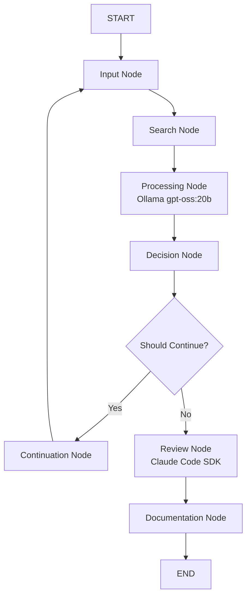

# LangGraph + Ollama AI Workflow Implementation

This project implements an AI-powered workflow using LangGraph with Ollama integration, featuring real-time search capabilities and intelligent response generation using the gpt-oss:20b model.

## 🔍 Research Background

This implementation is based on comprehensive parallel search research conducted using the `psearch` tool:

- **Search Query**: "LangGraph AI workflow implementation" 
- **Search Results**: 38 unique results from Google and Bing
- **Key Resources Found**:
  - LangGraph official documentation and examples
  - Japanese tutorials and implementation guides
  - Multi-agent workflow examples
  - Best practices and patterns

## 📋 Features

- **AI Integration**: Ollama gpt-oss:20b model integration for intelligent responses
- **Real-time Search**: `psearch` integration with live progress visualization
- **State Management**: Type-safe state handling with TypedDict
- **Node Processing**: Input, search, processing, decision making, and continuation logic
- **Conditional Routing**: Dynamic workflow routing based on iteration count
- **Message History**: Conversation-style message tracking with AI responses
- **Progress Visualization**: Real-time display of search progress and results
- **Japanese Language Support**: Native Japanese response generation
- **🆕 Claude Code SDK Integration**: Automated review and fact-checking using Claude Code SDK
- **🆕 Documentation Generation**: Automatic markdown documentation with comparison analysis
- **🆕 Quality Assurance**: Multi-AI system validation for improved output accuracy

## 🚀 Getting Started

### Prerequisites

- Python 3.12+
- uv package manager
- Ollama installed and running (`ollama serve`)
- gpt-oss:20b model installed (`ollama pull gpt-oss:20b`)
- `psearch` command available for search functionality
- Claude Code SDK (`pip install claude-code-sdk`)
- Claude Code CLI (`npm install -g @anthropic-ai/claude-code`)

### Installation

1. Clone or navigate to the project directory:
```bash
cd langgraph-workflow
```

2. Create virtual environment with uv:
```bash
uv venv
source .venv/bin/activate  # On Linux/Mac
```

3. Install dependencies:
```bash
uv pip install -r requirements.txt
```

### Running the Workflow

1. Start Ollama server:
```bash
ollama serve
```

2. Ensure gpt-oss:20b model is available:
```bash
ollama pull gpt-oss:20b
```

3. Execute the AI workflow:
```bash
python ollama_workflow.py
```

Expected output:
```
🚀 Starting LangGraph Workflow with Ollama gpt-oss:20b
============================================================
🔍 Checking Ollama connection...
✅ Ollama is running with X models
✅ gpt-oss:20b model is available

💬 Please enter your question:
❓ [Your question here]

📋 Initial State:
  User Input: [Your question]
  Iteration: 0

⚡ Executing Workflow with Ollama...
----------------------------------------
🔍 Searching for information about: [Your question]
📊 Progress visualization:
----------------------------------------
📤 [Real-time psearch output...]
📤 [Search progress...]
----------------------------------------
✅ Search completed successfully
📄 Found X results

🤖 Processing iteration 1 with Ollama gpt-oss:20b...
✅ LLM Full Response:
[AI-generated Japanese response based on search results]
```

## 📐 Architecture

### Workflow Nodes

1. **Input Node**: Processes user input and manages message history
2. **Search Node**: Executes `psearch` with real-time progress visualization
3. **Processing Node**: Uses Ollama gpt-oss:20b to generate AI responses with search context
4. **Decision Node**: Determines whether to continue or terminate workflow
5. **Continuation Node**: Prepares state for next iteration
6. **🆕 Review Node**: Uses Claude Code SDK to review and fact-check AI responses
7. **🆕 Documentation Node**: Generates markdown documentation comparing outputs

### State Structure

```python
class WorkflowState(TypedDict):
    messages: list[BaseMessage]      # Conversation history with AI responses
    iteration: int                   # Current iteration count
    user_input: str                 # Current user input
    processed_output: str           # Latest AI-generated output
    should_continue: bool           # Continue/terminate flag
    search_results: str             # Results from psearch integration
    initial_output: str             # First AI output for comparison
    reviewed_output: str            # Claude Code reviewed output
    document_generated: bool        # Document generation status
```

### Workflow Flow



## 🎯 Key Concepts Demonstrated

- **StateGraph**: LangGraph's core workflow orchestration
- **AI Integration**: Ollama local LLM integration with gpt-oss:20b
- **Real-time Search**: `psearch` integration with streaming output
- **Conditional Edges**: Dynamic routing based on state conditions
- **Message Management**: Conversation-style state persistence with AI responses
- **Iterative Processing**: Loop-based workflow execution with AI feedback
- **Type Safety**: Python typing for robust state management
- **Progress Visualization**: Real-time display of search and processing status
- **🆕 Multi-AI Validation**: Claude Code SDK for automated review and quality assurance
- **🆕 Documentation Automation**: Automated markdown generation with comparison analysis
- **🆕 Workflow Enhancement**: Extended node architecture for production-ready AI workflows

## 🔧 Customization

To extend this workflow:

1. **Add New Nodes**: Implement additional processing steps (e.g., data analysis, file processing)
2. **Modify AI Model**: Switch to different Ollama models or adjust parameters
3. **Enhanced Search**: Customize `psearch` parameters or integrate other search tools
4. **Language Customization**: Modify system prompts for different languages or domains
5. **Enhanced State**: Add new fields to WorkflowState for additional context
6. **Integration**: Connect to external APIs, databases, or other AI services

## 📚 Based on Research

This implementation incorporates patterns and best practices found through parallel search research, including:

- Official LangGraph documentation patterns
- Community examples and tutorials  
- Multi-agent workflow architectures
- Japanese developer community insights

## 🔗 Dependencies

- `langgraph>=0.6.6`: Core workflow orchestration
- `langchain>=0.3.27`: Message types and base classes
- `langchain-community>=0.3.29`: Extended functionality
- `langchain-ollama>=0.4.32`: Ollama integration for local LLM
- `python-dotenv>=1.1.1`: Environment configuration
- `requests>=2.32.3`: HTTP requests for Ollama API checking
- `claude-code-sdk>=0.0.20`: Claude Code SDK integration for AI review

### External Tools
- **Ollama**: Local LLM runtime (`https://ollama.com/`)
- **gpt-oss:20b**: Open-source GPT model via Ollama
- **psearch**: Parallel search tool for information retrieval
- **Claude Code**: AI development assistant (`https://claude.ai/code`)
- **@anthropic-ai/claude-code**: Claude Code CLI for SDK integration

## 📄 License

This project is created for educational and demonstration purposes.