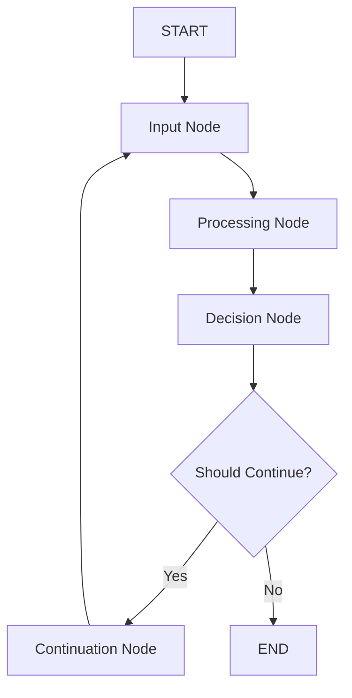

# LangGraph Workflow Implementation

This project implements a simple workflow using LangGraph, demonstrating the core concepts of state management, node processing, and conditional routing discovered through parallel search research.

## 🔍 Research Background

This implementation is based on comprehensive parallel search research conducted using the `psearch` tool:

- **Search Query**: "LangGraph AI workflow implementation" 
- **Search Results**: 38 unique results from Google and Bing
- **Key Resources Found**:
  - LangGraph official documentation and examples
  - Japanese tutorials and implementation guides
  - Multi-agent workflow examples
  - Best practices and patterns

## 📋 Features

- **State Management**: Type-safe state handling with TypedDict
- **Node Processing**: Input processing, decision making, and continuation logic  
- **Conditional Routing**: Dynamic workflow routing based on iteration count
- **Message History**: Conversation-style message tracking
- **Simple Loop**: Iterative processing with configurable termination

## 🚀 Getting Started

### Prerequisites

- Python 3.12+
- uv package manager

### Installation

1. Clone or navigate to the project directory:
```bash
cd langgraph-workflow
```

2. Create virtual environment with uv:
```bash
uv venv
source .venv/bin/activate  # On Linux/Mac
```

3. Install dependencies:
```bash
uv pip install -r requirements.txt
```

### Running the Workflow

Execute the simple workflow example:

```bash
python simple_workflow.py
```

Expected output:
```
🚀 Starting LangGraph Workflow Implementation
==================================================
📋 Initial State:
  User Input: Hello, please process this LangGraph workflow example
  Iteration: 0

⚡ Executing Workflow...
------------------------------
✅ Workflow Completed!
==================================================
📊 Final Results:
  Total Iterations: 3
  Final Output: Processing iteration 3: Continue processing from iteration 2
  Message Count: 8
```

## 📐 Architecture

### Workflow Nodes

1. **Input Node**: Processes user input and manages message history
2. **Processing Node**: Generates responses and updates conversation state
3. **Decision Node**: Determines whether to continue or terminate workflow
4. **Continuation Node**: Prepares state for next iteration

### State Structure

```python
class WorkflowState(TypedDict):
    messages: list[BaseMessage]      # Conversation history
    iteration: int                   # Current iteration count
    user_input: str                 # Current user input
    processed_output: str           # Latest processed output
    should_continue: bool           # Continue/terminate flag
```

### Workflow Flow



## 🎯 Key Concepts Demonstrated

- **StateGraph**: LangGraph's core workflow orchestration
- **Conditional Edges**: Dynamic routing based on state conditions
- **Message Management**: Conversation-style state persistence
- **Iterative Processing**: Loop-based workflow execution
- **Type Safety**: Python typing for robust state management

## 🔧 Customization

To extend this workflow:

1. **Add New Nodes**: Implement additional processing steps
2. **Modify Decision Logic**: Change termination conditions
3. **Enhanced State**: Add new fields to WorkflowState
4. **Integration**: Connect to external APIs or LLMs

## 📚 Based on Research

This implementation incorporates patterns and best practices found through parallel search research, including:

- Official LangGraph documentation patterns
- Community examples and tutorials  
- Multi-agent workflow architectures
- Japanese developer community insights

## 🔗 Dependencies

- `langgraph>=0.6.6`: Core workflow orchestration
- `langchain>=0.3.27`: Message types and base classes
- `langchain-community>=0.3.29`: Extended functionality
- `langchain-openai>=0.3.32`: OpenAI integration (optional)
- `python-dotenv>=1.1.1`: Environment configuration

## 📄 License

This project is created for educational and demonstration purposes.